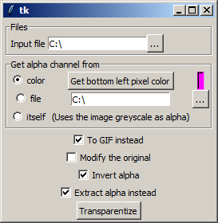

# Transparentizer
Dirty as hay, learn python with this file at your own risks.
TheDarkTiger 2018 - 2023

## The scrip
A small python 3 script to change image's alpha.
It uses Tk for the GUI and Pillow / PIL for the image manipulation part.

It's not bug free, it's ugly, it's a usefull tool I did for me.
But if you can find something interesting in it, please fork it.

## How to use install?

### Classic python install
Install Python >=3.7
Install pillow (pip install pillow)
You should be able to run the scrip by using "python Transparentizer.py"

### Windows executable
Not yet available

## How to use?
Just run the script.
You can chose your input image and the options needed to treat the alpha channel.
Please note that it's by design that the color information is kept even if alpha is fully transparent.
Remember, premultiplied alpha should only be used it particular cases like final usage, and not for editing.

